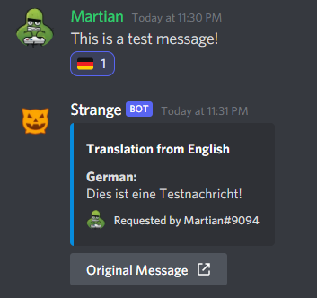

# ⚙ Admin


These commands can only be used by members who have **MANAGE\_SERVER** permission


### Set Prefix

* **Description**: Set bot prefix
* **Usage**: `!setprefix <newPrefix>`

### Automod Configuration

|                                              |                                                                |
| -------------------------------------------- | -------------------------------------------------------------- |
| **!automodconfig status**                    | view configuration status                                      |
| **!automodconfig strikes \<amount>**         | Set the maximum number of strikes before taking an action      |
| **!automodconfig action \<kick\|mute\|ban>** | Set the action to be performed after receiving maximum strikes |
| **!automodconfig debug \<on\|off>**          | turns on automod for messages sent by admins and moderators    |


By default, Auto moderation events are ignored for members who have the following permissions since they are assumed to be channel/server moderators

**KICK\_MEMBERS**, **BAN\_MEMBERS**, **MANAGE\_GUILD**, **MANAGE\_MESSAGES**

`!automodconfig debug on` disables this


### Automod Events

| Name                                   | Description                                                                 |
| -------------------------------------- | --------------------------------------------------------------------------- |
| **!automod antighostping \<on\|off>**  | Logs ghost mentions in your server (Requires `/modlog` channel to be setup) |
| **!automod antiinvites \<on\|off>**    | Allow or disallow sending discord invites in message                        |
| **!automod antilinks \<on\|off>**      | Allow or disallow sending links in message                                  |
| **!automod antiscam \<on\|off>**       | Enable or disable antiscam detection                                        |
| **!automod maxlines \<amount>**        | Sets maximum lines allowed per message                                      |
| **!automod maxmentions \<amount>**     | Sets maximum user mentions allowed per message                              |
| **!automod maxrolementions \<amount>** | Sets maximum role mentions allowed per message                              |


Each time a member tries to break the automated rule, he/she **receives a strike**. After receiving the maximum number of strikes (default 5), the moderation action (default MUTE) is performed on them


### Counter Channels

* **Description: **setup counter channel in the guild
* **Usage**: `!counter <counter_type> <name>`
* **Available counters** **types**
  * USERS: counts the total server member count (members + bots)
  * MEMBERS: counts the total member count
  * BOTS: counts the total number of bots

### Max Warn

* **!maxwarn limit \<amount>**: set max warnings a member can receive before taking an action
* **!maxwarn action \<mute|kick|ban>**: set the action to be performed after receiving maximum warnings

### Flag Translations

_Enabling this feature will allow members to simply react to any message with a country flag emoji, translating that message content to regional language_

* **Description**: configure flag translation in the server
* **Usage**: `!flagtr <on|off>`

### Moderation Logging

* **Description**: enable or disable moderation logs
* **Usage**: `!modlog <channel|off>`


Moderation logging enable logging of all **moderation actions** and **automod events**


### Mute Setup

* **Description**: setup muted role
* **Usage**: `!mutesetup`

### XP System

* **Description**: configure the ranking system in the server
* **Usage**: `!xpsystem <on|off>`

### Greeting



**!welcome status \<on|off>**

* Enable or disable welcome message

**!welcome channel <#channel>**

* configure channel where welcome messages must be sent

**!welcome preview**

* send a welcome preview

**!welcome desc \<content>**

* set welcome embed description

**!welcome footer \<content>**

* set welcome embed footer

**!welcome thumbnail \<on|off>**

* enable or disable welcome message thumbnail

**!welcome color <#hex>**

* set welcome embed color



**!farewell status \<on|off>**

* Enable or disable farewell message

**!farewell channel <#channel>**

* configure channel where farewell messages must be sent

**!farewell preview**

* send a farewell preview

**!farewell desc \<content>**

* set farewell embed description

**!farewell footer \<content>**

* set farewell embed footer

**!farewell thumbnail \<on|off>**

* enable or disable farewell message thumbnail

**!farewell color <#hex>**

* set farewell embed color




#### Allowed Content Replacements

* \n : New Line&#x20;
* {server} : Server Name&#x20;
* {count} : Server member count&#x20;
* {member:name} : Member Name&#x20;
* {member:tag} : Member Tag&#x20;
* {inviter:name} : Inviter Name&#x20;
* {inviter:tag} : Inviter Tag&#x20;
* {invites} : Inviter Invites


### Reaction Roles

#### Create Reaction Role

* **Usage**: !addrr <#channel> \<messageId> \<role> \<emote>
* **Description**: setup reaction role for the specified message

#### Remove Reaction Roles

* **Usage**: !removerr <#channel> \<messageId>
* **Description**: remove configured reaction for the specified message

### Ticketing

**Configuration**

* **!ticket setup**: setup a new ticket message
* **!ticket log <#channel>**: setup log channel for tickets
* **!ticket limit \<amount>**: set maximum number of concurrent open tickets
* **!ticket closeall**: close all open tickets

#### Ticket Channel Commands

* **!ticket add \<userId|roleId>**: add user/role to the ticket
* **!ticket remove \<userId|roleId>**: remove user/role from the ticket

